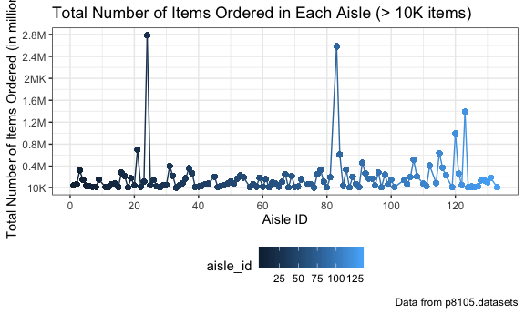

P8105\_hw3\_yc384
================
Ying Chen (UNI: yc384)
10/5/2019

## P8105 DS HW 3

#### This homework includes figures; the readability embedded plots (e.g.font sizes, axis labels, titles)

### Problem 0

  - created a public GitHub repo + local R Project named:
    p8105\_hw3\_yc384
  - created a single .Rmd file named p8105\_hw3\_yc384.Rmd that renders
    to github\_document
  - created a subdirectory to store the local data files used in
    Problems 1 and 2, and use relative paths to access these data files
  - submit this link of my repo via Courseworks:
    <https://github.com/YingCarolineChen/P8105_hw3_yc384.git>

created a public GitHub repo and local R Project named p8105\_hw3\_yc384
- created a .Rmd file named p8105\_hw3\_yc384.Rmd that renders to
github\_document - created a subdirectory to store the local data files
used in Problems 1 and 2, and use relative paths to access these data
files - submit this link of my repo via Courseworks:
<https://github.com/YingCarolineChen/P8105_hw3_yc384.git>

setwd(“/Users/macbook/Documents/Statistics/P8105/HW/P8105\_HW3\_yc384”)

#### We first setup our default R working enviroment

``` r
library (tidyverse)
```

    ## ── Attaching packages ──────────────────────────────────────────────── tidyverse 1.2.1 ──

    ## ✔ ggplot2 3.2.1     ✔ purrr   0.3.2
    ## ✔ tibble  2.1.3     ✔ dplyr   0.8.3
    ## ✔ tidyr   1.0.0     ✔ stringr 1.4.0
    ## ✔ readr   1.3.1     ✔ forcats 0.4.0

    ## ── Conflicts ─────────────────────────────────────────────────── tidyverse_conflicts() ──
    ## ✖ dplyr::filter() masks stats::filter()
    ## ✖ dplyr::lag()    masks stats::lag()

``` r
library (dplyr)
library(readxl)
library(patchwork)

# library for hw3 datasets 
library(p8105.datasets)

rm(list = ls())

knitr::opts_chunk$set(echo = TRUE, warning = TRUE,
  fig.width = 6,
  fig.asp = .6,
  out.width = "100%"
)
theme_set(theme_bw() + theme(legend.position = "bottom"))
options(tibble.print_min = 3)
```

### **Problem 1:** This problem uses the Instacart data.

#### 1-0 Import and tidy data for hw3-problem 1

For this homework we are using data from “The Instacart Online Grocery
Shopping Dataset 2017”. Instacart is an online grocery service that
allows you to shop online from local stores. The original data is very
extensive and we are only using a cleaned and limited version of the
data.

For varaible eval\_set, all observation has a value of “train”
exclusively. We will also rename some of the varaibles to make it more
meaningful to readers.

``` r
# Load dataset for problem 1 from library P8105.datasets
data("instacart")

# tidy data
instacart = 
  janitor::clean_names(instacart) %>% 
  # rename long varaibles
  rename(order_hr = order_hour_of_day, order_days = days_since_prior_order, order_weekday = order_dow) %>%
  # reorder data
  arrange(order_number, aisle_id) %>%
  select(aisle_id, product_name, order_number, order_hr, order_days, everything()) %>% 
  # remove duplicate rows
  distinct(instacart)
```

    ## Warning: Trying to compute distinct() for variables not found in the data:
    ## - `instacart`
    ## This is an error, but only a warning is raised for compatibility reasons.
    ## The operation will return the input unchanged.

The instacart had 15 variables 1384617 oberserations. There were no
duplicates and no observations were removed. Rows are items ordered by
each customer and columns are other information related to that
order.

#### 1-1 Perform EDA

#### 1-1 Write a short description of the dataset, noting the size and structure of the data, describing some key variables, and giving illstrative examples of observations.

``` r
summary(instacart)
```

    ##     aisle_id     product_name        order_number       order_hr    
    ##  Min.   :  1.0   Length:1384617     Min.   :  4.00   Min.   : 0.00  
    ##  1st Qu.: 31.0   Class :character   1st Qu.:  6.00   1st Qu.:10.00  
    ##  Median : 83.0   Mode  :character   Median : 11.00   Median :14.00  
    ##  Mean   : 71.3                      Mean   : 17.09   Mean   :13.58  
    ##  3rd Qu.:107.0                      3rd Qu.: 21.00   3rd Qu.:17.00  
    ##  Max.   :134.0                      Max.   :100.00   Max.   :23.00  
    ##    order_days       order_id         product_id    add_to_cart_order
    ##  Min.   : 0.00   Min.   :      1   Min.   :    1   Min.   : 1.000   
    ##  1st Qu.: 7.00   1st Qu.: 843370   1st Qu.:13380   1st Qu.: 3.000   
    ##  Median :15.00   Median :1701880   Median :25298   Median : 7.000   
    ##  Mean   :17.07   Mean   :1706298   Mean   :25556   Mean   : 8.758   
    ##  3rd Qu.:30.00   3rd Qu.:2568023   3rd Qu.:37940   3rd Qu.:12.000   
    ##  Max.   :30.00   Max.   :3421070   Max.   :49688   Max.   :80.000   
    ##    reordered         user_id         eval_set         order_weekday  
    ##  Min.   :0.0000   Min.   :     1   Length:1384617     Min.   :0.000  
    ##  1st Qu.:0.0000   1st Qu.: 51732   Class :character   1st Qu.:1.000  
    ##  Median :1.0000   Median :102933   Mode  :character   Median :3.000  
    ##  Mean   :0.5986   Mean   :103113                      Mean   :2.701  
    ##  3rd Qu.:1.0000   3rd Qu.:154959                      3rd Qu.:5.000  
    ##  Max.   :1.0000   Max.   :206209                      Max.   :6.000  
    ##  department_id      aisle            department       
    ##  Min.   : 1.00   Length:1384617     Length:1384617    
    ##  1st Qu.: 4.00   Class :character   Class :character  
    ##  Median : 8.00   Mode  :character   Mode  :character  
    ##  Mean   : 9.84                                        
    ##  3rd Qu.:16.00                                        
    ##  Max.   :21.00

``` r
head(instacart)
```

    ## # A tibble: 6 x 15
    ##   aisle_id product_name order_number order_hr order_days order_id
    ##      <int> <chr>               <int>    <int>      <int>    <int>
    ## 1        1 Picnic Pota…            4        7         30     1139
    ## 2        1 Roasted Tom…            4       12         30    21847
    ## 3        1 Chili                   4       20         30    22800
    ## 4        1 Cut Hearts …            4       10          2    38835
    ## 5        1 Classic Chi…            4       16          7    52387
    ## 6        1 Chicken Noo…            4       13          1    66543
    ## # … with 9 more variables: product_id <int>, add_to_cart_order <int>,
    ## #   reordered <int>, user_id <int>, eval_set <chr>, order_weekday <int>,
    ## #   department_id <int>, aisle <chr>, department <chr>

**Answer:** We run a summary of the tidied dataset “instacart” that was
loaded. There are 5 different ids: order\_id, producti\_id, user\_id,
aisle\_id, department\_id. Depend on the needs of the analysis, we may
use different ids. From the data summary, we can see that there are 134
aisles, 21 Departments and 49688 products. The summary also tells us
that 206209 users made 3421070 orders in total. The minimum order that a
product

From the first 5 lines of data, we can see that aisle one has food from
deli department and has product of prepared soups
salads.

#### 1-2-1 How many aisles are there, and which aisles are the most items ordered from?

``` r
# number of aisles
instacart %>% 
  # group by aisles
  group_by(aisle_id) %>% 
  # count how often aisle appears
  count(aisle) %>% 
  # display number of rows in the table
  nrow()
```

    ## [1] 134

``` r
# most selling aisle
instacart %>% 
  group_by(aisle_id) %>% 
  # count number of observations in each aisle
  summarize(
      n_order = n()) %>% 
  # sort aisle with highest sell on top
  mutate(rank = (rank(n_order))) %>%
  arrange(desc(rank)) %>% 
  # list top 5 aisles with most sells 
  top_n(5) %>% 
  # print table
  knitr::kable(caption = "Top 5 Selling Aisles", digits = 2)  
```

    ## Selecting by rank

| aisle\_id | n\_order | rank |
| --------: | -------: | ---: |
|        83 |   150609 |  134 |
|        24 |   150473 |  133 |
|       123 |    78493 |  132 |
|       120 |    55240 |  131 |
|        21 |    41699 |  130 |

Top 5 Selling Aisles

**Answer:** From the above result, we can see that there are 134 aisels.
And the aile that had most items ordered from are 83, with total of
150609 items sold. And the 2nd one is aisle 24 with 150473 items
sold.

#### 1-2-2 Make a plot that shows the number of items ordered in each aisle, limiting this to aisles with \> 10000 items ordered. Arrange aisles sensibly, and organize your plot so others can read it.

From the plots below, we can see that fresh vegetables and fresh fruits
are the aisles that had the most orders from. Looks like people who are
using this online ordering service are healthy eaters.

``` r
instacart %>%
 group_by(aisle) %>% 
  summarize(n_order = n()) %>%
  mutate(rank = rank(n_order)) %>% 
  arrange(desc(rank)) %>% 
  # plot scatterplot
  ggplot(aes(x = reorder(aisle, -rank), y = n_order)) +
   # plot points
   geom_bar(stat = "identity", aes(fill = n_order, show.legend = FALSE)) +
    labs(
      title = "Total Number of Items Ordered in Each Aisle (> 10K items)",
      x = "Aisle ID",
      y = "Total Number of Items Ordered",
      caption = "Data from p8105.datasets-instacart"
      ) 
```

    ## Warning: Ignoring unknown aesthetics: show.legend



#### 1-2-3 Make a table showing the three most popular items in each of the aisles “baking ingredients”, “dog food care”, and “packaged vegetables fruits”. Include the number of times each item is ordered in your table.

``` r
  instacart %>% 
  filter(aisle == "baking ingredients" | aisle == "dog food care" | 
         aisle == "packaged vegetables fruits") %>% 
  group_by(aisle, product_name) %>% 
  summarize(total = n()) %>% 
  group_by(aisle)%>% 
  filter(total == max(total)) %>%
  knitr::kable(caption = "Most Popular Item in the 3 Aisles")
```

| aisle                      | product\_name                                 | total |
| :------------------------- | :-------------------------------------------- | ----: |
| baking ingredients         | Light Brown Sugar                             |   499 |
| dog food care              | Snack Sticks Chicken & Rice Recipe Dog Treats |    30 |
| packaged vegetables fruits | Organic Baby Spinach                          |  9784 |

Most Popular Item in the 3 Aisles

**Answer:** From the results above, we can see that the three most
popular items in each of the aisles “baking ingredients”, “dog food
care”, and “packaged vegetables fruits” are: Light Brown Sugar from
backing ingredients (499 orders), dog food care Snack Sticks Chicken &
Rice Recipe Dog Treats (30 orders) and Organic Baby Spinach (9784
orders).

#### 1-2-4 Make a table showing the mean hour of the day at which Pink Lady Apples and Coffee Ice Cream are ordered on each day of the week; format this table for human readers (i.e.produce a 2 x 7 table)

``` r
instacart %>% 
  filter(product_name == "Pink Lady Apples"|product_name == "Coffee Ice Cream") %>% 
  mutate(order_day = recode_factor(order_weekday,
         "0" = "Sunday",
         "1" = "Monday",
         "2" = "Tuesday",
         "3" = "Wednesday",
         "4" = "Thursday",
         "5" = "Friday",
         "6" = "Saturday",
         )) %>% 
  group_by(product_name, order_day) %>%
  summarize(mean = mean(order_hr)) %>% 
  spread(key = order_day, value = mean) %>% 
  knitr::kable(caption = "Mean hour of day Pink Lady Apples were ordered", digits = 2)
```

| product\_name    | Sunday | Monday | Tuesday | Wednesday | Thursday | Friday | Saturday |
| :--------------- | -----: | -----: | ------: | --------: | -------: | -----: | -------: |
| Coffee Ice Cream |  13.77 |  14.32 |   15.38 |     15.32 |    15.22 |  12.26 |    13.83 |
| Pink Lady Apples |  13.44 |  11.36 |   11.70 |     14.25 |    11.55 |  12.78 |    11.94 |

Mean hour of day Pink Lady Apples were ordered

**Answer:** From the above results, we can see that everyday, customers
always order apples around noon by lunch time and ice cream in the
afternoon.

### **Problem 2:** This problem uses the BRFSS data.

``` r
library(p8105.datasets)
data("BRFSS")
```

    ## Warning in data("BRFSS"): data set 'BRFSS' not found

#### 2-1 First, do some data cleaning: format the data to use appropriate variable names; focus on the “Overall Health” topic, include only responses from “Excellent” to “Poor”; organize responses as a factor taking levels ordered from “Poor” to “Excellent”

#### 2-2 do or answer the following (commenting on the results of each):

#### \* 2-2-1 In 2002, which states were observed at 7 or more locations? What about in 2010?

#### \* 2-2-2 Construct a dataset that is limited to Excellent responses, and contains, year, state, and a variable that averages the data\_value across locations within a state. Make a “spaghetti” plot of this average value over time within a state (that is, make a plot showing a line for each state across years – the geom\_line geometry and group aesthetic will help).

#### \* 2-2-3 Make a two-panel plot showing, for the years 2006, and 2010, distribution of data\_value for responses (“Poor” to “Excellent”) among locations in NY State.

### **Problem 3:** This problem uses the accel\_data. In this spreadsheet,

variables activity.\* are the activity counts for each minute of a
24-hour day starting at
midnight.

#### 3-1-1 Load, tidy, and otherwise wrangle the data. Dataset should include all originally observed variables and values; have useful variable names;

#### 3-1-2 Include a weekday vs weekend variable; and encode data with reasonable variable classes.

#### 3-1-3 Describe the resulting dataset (e.g. what variables exist, how many observations, etc).

#### 3-2-1 Using your tidied dataset, aggregate accross minutes to create a total activity variable for each day, and create a table showing these totals. Are any trends apparent?

#### 3-2-2 Make a single-panel plot that shows the 24-hour activity time courses for each day and use color to indicate day of the week.

#### 3-2-3 Describe in words any patterns or conclusions you can make based on this graph.
