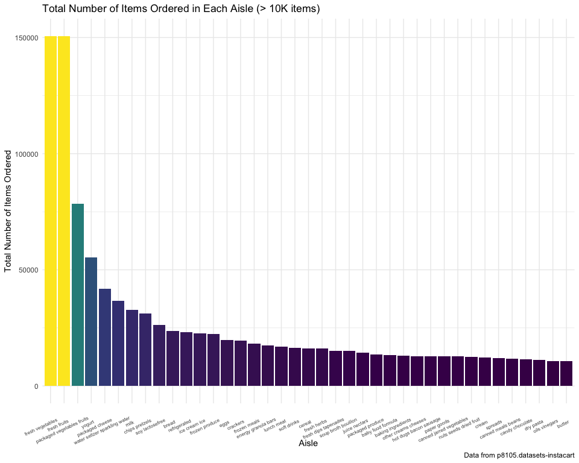
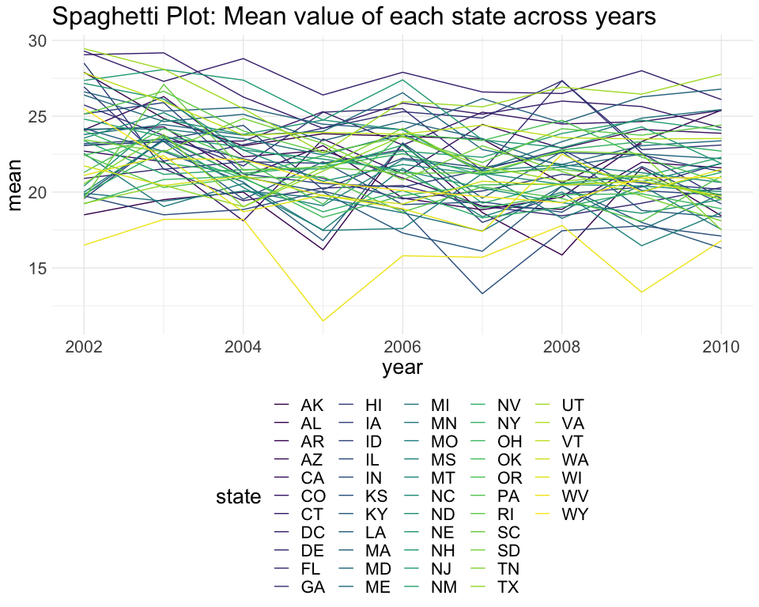
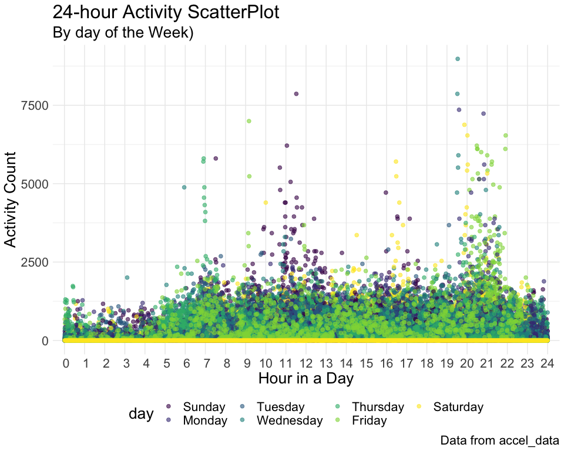

P8105\_hw3\_yc384
================
Ying Chen (UNI: yc384)
10/5/2019

## P8105 DS HW 3

#### This homework includes figures; the readability embedded plots (e.g.font sizes, axis labels, titles)

### Problem 0

  - created a public GitHub repo + local R Project named:
    p8105\_hw3\_yc384
  - created a single .Rmd file named p8105\_hw3\_yc384.Rmd that renders
    to github\_document
  - created a subdirectory to store the local data files used in
    Problems 1 and 2, and use relative paths to access these data files
  - submit this link of my repo via Courseworks:
    <https://github.com/YingCarolineChen/P8105_hw3_yc384.git>

created a public GitHub repo and local R Project named p8105\_hw3\_yc384
- created a .Rmd file named p8105\_hw3\_yc384.Rmd that renders to
github\_document - created a subdirectory to store the local data files
used in Problems 1 and 2, and use relative paths to access these data
files - submit this link of my repo via Courseworks:
<https://github.com/YingCarolineChen/P8105_hw3_yc384.git>

setwd(“/Users/macbook/Documents/Statistics/P8105/HW/P8105\_HW3\_yc384”)

#### We first setup our default R working enviroment

``` r
library (tidyverse)
```

    ## ── Attaching packages ──────────────────────────────────────── tidyverse 1.2.1 ──

    ## ✔ ggplot2 3.2.1     ✔ purrr   0.3.2
    ## ✔ tibble  2.1.3     ✔ dplyr   0.8.3
    ## ✔ tidyr   1.0.0     ✔ stringr 1.4.0
    ## ✔ readr   1.3.1     ✔ forcats 0.4.0

    ## ── Conflicts ─────────────────────────────────────────── tidyverse_conflicts() ──
    ## ✖ dplyr::filter() masks stats::filter()
    ## ✖ dplyr::lag()    masks stats::lag()

``` r
library (dplyr)
library(readxl)
library(patchwork)

# library for hw3 datasets 
library(p8105.datasets)

rm(list = ls())

knitr::opts_chunk$set(
    echo = TRUE,
    warning = FALSE,
    fig.width = 10, 
  fig.height = 8,
  out.width = "100%"
)

scale_colour_discrete = scale_colour_viridis_d
scale_fill_discrete = scale_fill_viridis_d

options(
  ggplot2.continuous.colour = "viridis",
  ggplot2.continuous.fill = "viridis"
)

theme_set(theme_minimal() + theme(legend.position = "bottom"))

options(tibble.print_min = 3)
```

### **Problem 1:** This problem uses the Instacart data.

#### 1-0 Import and tidy data for hw3-problem 1

For this homework we are using data from “The Instacart Online Grocery
Shopping Dataset 2017”. Instacart is an online grocery service that
allows you to shop online from local stores. The original data is very
extensive and we are only using a cleaned and limited version of the
data.

For varaible eval\_set, all observation has a value of “train”
exclusively. We will also rename some of the varaibles to make it more
meaningful to readers.

``` r
# Load dataset for problem 1 from library P8105.datasets
data("instacart")

# tidy data
instacart = 
  janitor::clean_names(instacart) %>% 
  # rename long varaibles
  rename(order_hr = order_hour_of_day, order_days = days_since_prior_order, order_weekday = order_dow) %>%
  # reorder data
  arrange(order_number, aisle_id) %>%
  select(aisle_id, product_name, order_number, order_hr, order_days, everything()) %>% 
  # remove duplicate rows
  distinct(instacart)
```

The instacart had 15 variables 1384617 oberserations. There were no
duplicates and no observations were removed. Rows are items ordered by
each customer and columns are other information related to that
order.

### 1-1 Perform EDA

#### 1-1 Write a short description of the dataset, noting the size and structure of the data, describing some key variables, and giving illstrative examples of observations.

``` r
summary(instacart)
```

    ##     aisle_id     product_name        order_number       order_hr    
    ##  Min.   :  1.0   Length:1384617     Min.   :  4.00   Min.   : 0.00  
    ##  1st Qu.: 31.0   Class :character   1st Qu.:  6.00   1st Qu.:10.00  
    ##  Median : 83.0   Mode  :character   Median : 11.00   Median :14.00  
    ##  Mean   : 71.3                      Mean   : 17.09   Mean   :13.58  
    ##  3rd Qu.:107.0                      3rd Qu.: 21.00   3rd Qu.:17.00  
    ##  Max.   :134.0                      Max.   :100.00   Max.   :23.00  
    ##    order_days       order_id         product_id    add_to_cart_order
    ##  Min.   : 0.00   Min.   :      1   Min.   :    1   Min.   : 1.000   
    ##  1st Qu.: 7.00   1st Qu.: 843370   1st Qu.:13380   1st Qu.: 3.000   
    ##  Median :15.00   Median :1701880   Median :25298   Median : 7.000   
    ##  Mean   :17.07   Mean   :1706298   Mean   :25556   Mean   : 8.758   
    ##  3rd Qu.:30.00   3rd Qu.:2568023   3rd Qu.:37940   3rd Qu.:12.000   
    ##  Max.   :30.00   Max.   :3421070   Max.   :49688   Max.   :80.000   
    ##    reordered         user_id         eval_set         order_weekday  
    ##  Min.   :0.0000   Min.   :     1   Length:1384617     Min.   :0.000  
    ##  1st Qu.:0.0000   1st Qu.: 51732   Class :character   1st Qu.:1.000  
    ##  Median :1.0000   Median :102933   Mode  :character   Median :3.000  
    ##  Mean   :0.5986   Mean   :103113                      Mean   :2.701  
    ##  3rd Qu.:1.0000   3rd Qu.:154959                      3rd Qu.:5.000  
    ##  Max.   :1.0000   Max.   :206209                      Max.   :6.000  
    ##  department_id      aisle            department       
    ##  Min.   : 1.00   Length:1384617     Length:1384617    
    ##  1st Qu.: 4.00   Class :character   Class :character  
    ##  Median : 8.00   Mode  :character   Mode  :character  
    ##  Mean   : 9.84                                        
    ##  3rd Qu.:16.00                                        
    ##  Max.   :21.00

``` r
head(instacart)
```

    ## # A tibble: 6 x 15
    ##   aisle_id product_name order_number order_hr order_days order_id
    ##      <int> <chr>               <int>    <int>      <int>    <int>
    ## 1        1 Picnic Pota…            4        7         30     1139
    ## 2        1 Roasted Tom…            4       12         30    21847
    ## 3        1 Chili                   4       20         30    22800
    ## 4        1 Cut Hearts …            4       10          2    38835
    ## 5        1 Classic Chi…            4       16          7    52387
    ## 6        1 Chicken Noo…            4       13          1    66543
    ## # … with 9 more variables: product_id <int>, add_to_cart_order <int>,
    ## #   reordered <int>, user_id <int>, eval_set <chr>, order_weekday <int>,
    ## #   department_id <int>, aisle <chr>, department <chr>

**Answer:** We run a summary of the tidied dataset “instacart” that was
loaded. There are 5 different ids: order\_id, producti\_id, user\_id,
aisle\_id, department\_id. Depend on the needs of the analysis, we may
use different ids. From the data summary, we can see that there are 134
aisles, 21 Departments and 49688 products. The summary also tells us
that 206209 users made 3421070 orders in total. The minimum order that a
product

From the first 5 lines of data, we can see that aisle one has food from
deli department and has product of prepared soups
salads.

### 1-2 How many aisles are there, and which aisles are the most items ordered from?

``` r
# number of aisles
instacart %>% 
  # group by aisles
  group_by(aisle_id) %>% 
  # count how often aisle appears
  count(aisle) %>% 
  # display number of rows in the table
  nrow()
```

    ## [1] 134

``` r
# most selling aisle
instacart %>% 
  group_by(aisle_id) %>% 
  #count number of observations in each aisle
  summarize(
      n_order = n()) %>% 
  # sort aisle with highest sell on top
  mutate(rank = (rank(n_order))) %>%
  arrange(desc(rank)) %>% 
  # list top 5 aisles with most sells 
  top_n(5) %>% 
  # print table
  knitr::kable(caption = "Top 5 Selling Aisles", digits = 2)  
```

    ## Selecting by rank

| aisle\_id | n\_order | rank |
| --------: | -------: | ---: |
|        83 |   150609 |  134 |
|        24 |   150473 |  133 |
|       123 |    78493 |  132 |
|       120 |    55240 |  131 |
|        21 |    41699 |  130 |

Top 5 Selling Aisles

**Answer:** From the above result, we can see that there are 134 aisels.
And the aile that had most items ordered from are 83, with total of
150609 items sold. And the 2nd one is aisle 24 with 150473 items
sold.

### 1-3 Make a plot that shows the number of items ordered in each aisle, limiting this to aisles with \> 10000 items ordered. Arrange aisles sensibly, and organize your plot so others can read it.

From the plots below, we can see that fresh vegetables and fresh fruits
are the aisles that had the most orders from. Looks like people who are
using this online ordering service are healthy eaters.

``` r
instacart %>%
 group_by(aisle) %>% 
  summarize(n_order = n()) %>%
  mutate(rank = rank(n_order)) %>% 
  arrange(desc(rank)) %>% 
  # plot scatterplot
  ggplot(aes(x = reorder(aisle, -rank), y = n_order)) +
   # plot points
   geom_bar(stat = "identity", aes(fill = n_order, show.legend = FALSE)) +
    labs(
      title = "Total Number of Items Ordered in Each Aisle (> 10K items)",
      x = "Aisle ID",
      y = "Total Number of Items Ordered",
      caption = "Data from p8105.datasets-instacart"
      ) 
```



### 1-4 Make a table showing the three most popular items in each of the aisles “baking ingredients”, “dog food care”, and “packaged vegetables fruits”. Include the number of times each item is ordered in your table.

``` r
  instacart %>% 
  filter(aisle == "baking ingredients" | aisle == "dog food care" | 
         aisle == "packaged vegetables fruits") %>% 
  group_by(aisle, product_name) %>% 
  summarize(total = n()) %>% 
  group_by(aisle)%>% 
  filter(total == max(total)) %>%
  knitr::kable(caption = "Most Popular Item in the 3 Aisles")
```

| aisle                      | product\_name                                 | total |
| :------------------------- | :-------------------------------------------- | ----: |
| baking ingredients         | Light Brown Sugar                             |   499 |
| dog food care              | Snack Sticks Chicken & Rice Recipe Dog Treats |    30 |
| packaged vegetables fruits | Organic Baby Spinach                          |  9784 |

Most Popular Item in the 3 Aisles

**Answer:** From the results above, we can see that the three most
popular items in each of the aisles “baking ingredients”, “dog food
care”, and “packaged vegetables fruits” are: Light Brown Sugar from
backing ingredients (499 orders), dog food care Snack Sticks Chicken &
Rice Recipe Dog Treats (30 orders) and Organic Baby Spinach (9784
orders).

#### 1-5 Make a table showing the mean hour of the day at which Pink Lady Apples and Coffee Ice Cream are ordered on each day of the week; format this table for human readers (i.e.produce a 2 x 7 table)

``` r
instacart %>% 
  filter(product_name == "Pink Lady Apples"|product_name == "Coffee Ice Cream") %>% 
  mutate(order_day = recode_factor(order_weekday,
         "0" = "Sunday",
         "1" = "Monday",
         "2" = "Tuesday",
         "3" = "Wednesday",
         "4" = "Thursday",
         "5" = "Friday",
         "6" = "Saturday",
         )) %>% 
  group_by(product_name, order_day) %>%
  summarize(mean = mean(order_hr)) %>% 
  spread(key = order_day, value = mean) %>% 
  knitr::kable(caption = "Mean hour of day Pink Lady Apples were ordered", digits = 2)
```

| product\_name    | Sunday | Monday | Tuesday | Wednesday | Thursday | Friday | Saturday |
| :--------------- | -----: | -----: | ------: | --------: | -------: | -----: | -------: |
| Coffee Ice Cream |  13.77 |  14.32 |   15.38 |     15.32 |    15.22 |  12.26 |    13.83 |
| Pink Lady Apples |  13.44 |  11.36 |   11.70 |     14.25 |    11.55 |  12.78 |    11.94 |

Mean hour of day Pink Lady Apples were ordered

**Answer:** From the above results, we can see that everyday, customers
always order apples around noon by lunch time and ice cream in the
afternoon.

### **Problem 2:** This problem uses the BRFSS data.

For this homework we are using data from the Behavioral Risk Factors
Surveillance System (BRFSS) for Selected Metropolitan Area Risk Trends
(SMART) for 2002-2010. BRFSS data can be used to identify emerging
health problems, establish and track health objectives, and develop and
evaluate public health policies and programs. BRFSS is a continuous,
state-based surveillance system that collects information about
modifiable risk factors for chronic diseases and other leading causes of
death.

The dataset contains roughly 134,000 rows and 21 columns. There is
information on lcoation, topic, question, response, and response number.
The data is structured so that each (multiple-choice) response to each
question is a separate row.

#### 2-1-0 Import data for hw3-problem 2

``` r
# Load dataset for problem 2 from library P8105.datasets
data("brfss_smart2010")
```

#### 2-1-0 We then look at the data to prepare for tidying

``` r
summary(brfss_smart2010)
```

    ##       Year      Locationabbr       Locationdesc          Class          
    ##  Min.   :2002   Length:134203      Length:134203      Length:134203     
    ##  1st Qu.:2005   Class :character   Class :character   Class :character  
    ##  Median :2007   Mode  :character   Mode  :character   Mode  :character  
    ##  Mean   :2007                                                           
    ##  3rd Qu.:2009                                                           
    ##  Max.   :2010                                                           
    ##                                                                         
    ##     Topic             Question           Response          Sample_Size    
    ##  Length:134203      Length:134203      Length:134203      Min.   :   1.0  
    ##  Class :character   Class :character   Class :character   1st Qu.:  59.0  
    ##  Mode  :character   Mode  :character   Mode  :character   Median : 153.0  
    ##                                                           Mean   : 271.7  
    ##                                                           3rd Qu.: 353.0  
    ##                                                           Max.   :4505.0  
    ##                                                           NA's   :2       
    ##    Data_value    Confidence_limit_Low Confidence_limit_High Display_order 
    ##  Min.   : 0.10   Min.   : 0.00        Min.   :  0.00        Min.   : 1.0  
    ##  1st Qu.:14.30   1st Qu.: 8.50        1st Qu.: 16.30        1st Qu.:16.0  
    ##  Median :33.20   Median :25.90        Median : 37.00        Median :32.0  
    ##  Mean   :43.23   Mean   :37.74        Mean   : 45.76        Mean   :32.4  
    ##  3rd Qu.:77.30   3rd Qu.:71.10        3rd Qu.: 81.55        3rd Qu.:48.0  
    ##  Max.   :99.90   Max.   :99.70        Max.   :100.00        Max.   :68.0  
    ##  NA's   :4515                                                             
    ##  Data_value_unit    Data_value_type    Data_Value_Footnote_Symbol
    ##  Length:134203      Length:134203      Length:134203             
    ##  Class :character   Class :character   Class :character          
    ##  Mode  :character   Mode  :character   Mode  :character          
    ##                                                                  
    ##                                                                  
    ##                                                                  
    ##                                                                  
    ##  Data_Value_Footnote  DataSource          ClassId         
    ##  Length:134203       Length:134203      Length:134203     
    ##  Class :character    Class :character   Class :character  
    ##  Mode  :character    Mode  :character   Mode  :character  
    ##                                                           
    ##                                                           
    ##                                                           
    ##                                                           
    ##    TopicId           LocationID         QuestionID       
    ##  Length:134203      Length:134203      Length:134203     
    ##  Class :character   Class :character   Class :character  
    ##  Mode  :character   Mode  :character   Mode  :character  
    ##                                                          
    ##                                                          
    ##                                                          
    ##                                                          
    ##     RESPID          GeoLocation       
    ##  Length:134203      Length:134203     
    ##  Class :character   Class :character  
    ##  Mode  :character   Mode  :character  
    ##                                       
    ##                                       
    ##                                       
    ## 

From above summary, we can see that there are many varaibles that have
very long names and names for location difficult to know exact meaning.
We will rename some of the varaibles in the code chunck
below.

### 2-1-1 Data cleaning: format the data to use appropriate variable names; focus on the “Overall Health” topic, include only responses from “Excellent” to “Poor”; organize responses as a factor taking levels ordered from “Poor” to “Excellent”

``` r
brfss = 
  janitor::clean_names(brfss_smart2010) %>%   
  # rename varaibles
  rename(state = locationabbr, location = locationdesc) %>%
  # focus on the "Overall Health" topic
  filter(topic == "Overall Health") %>% 
  # recode response as a factor varaible
  mutate(
    response = forcats::fct_relevel(response, c("Poor", "Fair", "Good", "Very good", "Excellent"))
  ) %>% 
  # select only needed variables
  select(year, state, location, response, data_value) %>% 
  #organize responses ordered from “Poor” to “Excellent”
  arrange(desc(response))

# make sure response is sorted correctly
head(brfss, 3)
```

    ## # A tibble: 3 x 5
    ##    year state location               response  data_value
    ##   <int> <chr> <chr>                  <fct>          <dbl>
    ## 1  2010 AL    AL - Jefferson County  Excellent       18.9
    ## 2  2010 AL    AL - Mobile County     Excellent       15.6
    ## 3  2010 AL    AL - Tuscaloosa County Excellent       20.8

``` r
tail(brfss, 3)
```

    ## # A tibble: 3 x 5
    ##    year state location              response data_value
    ##   <int> <chr> <chr>                 <fct>         <dbl>
    ## 1  2002 WV    WV - Kanawha County   Poor            8.3
    ## 2  2002 WI    WI - Milwaukee County Poor            3.3
    ## 3  2002 WY    WY - Laramie County   Poor            4

### 2-2 do or answer the following (commenting on the results of each):

#### 2-2-1 In 2002, which states were observed at 7 or more locations? What about in 2010?

``` r
brfss %>% 
    # select year 2002
    filter(year == "2002") %>%  
    group_by(state) %>% 
    # remove duplicate locations 
    distinct(location) %>% 
    # count of loctions for each state
    summarize(n_location = n()) %>% 
    # select states with 7 or more locations in 2002
    filter(n_location >= 7) %>% 
    arrange(n_location) %>% 
    # print table
    knitr::kable(caption = "States: 7 or more locations in 2002")
```

| state | n\_location |
| :---- | ----------: |
| CT    |           7 |
| FL    |           7 |
| NC    |           7 |
| MA    |           8 |
| NJ    |           8 |
| PA    |          10 |

States: 7 or more locations in 2002

**Answer:** From above results, we can see that in 2002, there were 6
states that were observed at 7 or more locations. PA, NJ and MA are the
states had most observed locations. For this question, we had to have
duplicates removed because each location had differnt responses and we
see multiple rows for each location.

``` r
brfss %>% 
    # select year 2010
    filter(year == "2010") %>%  
    group_by(state) %>% 
    # remove duplicate locations 
    distinct(location) %>% 
    # count of loctions for each state
    summarize(n_location = n()) %>% 
    # select states with 7 or more locations in 2002
    filter(n_location >= 7) %>% 
    arrange(n_location) %>% 
    # print table
    knitr::kable(caption = "States: 7 or more locations in 2010")
```

| state | n\_location |
| :---- | ----------: |
| CO    |           7 |
| PA    |           7 |
| SC    |           7 |
| OH    |           8 |
| MA    |           9 |
| NY    |           9 |
| NE    |          10 |
| WA    |          10 |
| CA    |          12 |
| MD    |          12 |
| NC    |          12 |
| TX    |          16 |
| NJ    |          19 |
| FL    |          41 |

States: 7 or more locations in 2010

**Answer:** From above results, we can see that in 2010, there were 14
states that were observed at 7 or more locations. The observed locations
significantly has been increased since 2002. FL, NJ and TX ranked top 3.
FL had 41 locations, more than doubled the locations of NJ. Ranking for
NJ did not change, but the loctions has increased from 8 to
19.

#### 2-2-2 Construct a dataset that is limited to Excellent responses, and contains, year, state, and a variable that averages the data\_value across locations within a state.

``` r
mean =
  brfss %>% 
    # remove missing data
    drop_na() %>% 
    # selected only needed variables
    select(year, response, state, data_value) %>% 
    # limited only to Excellent responses
    filter(response == "Excellent") %>% 
    # group by state
    group_by(state, year) %>% 
    # take the mean of data_value
    summarize(
      mean = mean(data_value)
    )
```

#### 2-2-2Make a “spaghetti” plot of this average value over time within a state (that is, make a plot showing a line for each state across years – the geom\_line geometry and group aesthetic will help).

``` r
mean %>% 
  group_by(state) %>% 
  ggplot ()+
  geom_line((aes(x = year, y = mean, group = state, color = state)))+
  ggtitle("Spaghetti Plot: Mean value of each state across years") +
  theme(text = element_text(size=20))
```



#### 2-3 Make a two-panel plot showing, for the years 2006, and 2010, distribution of data\_value for responses (“Poor” to “Excellent”) among locations in NY State.

``` r
# made a plot table for NY and year 2006, 2010
ny = 
   brfss %>% 
    select(year, response, state, location, data_value) %>% 
    # group by vars
    group_by(year, state, location) %>% 
    # limited NY and year 2006
    filter(state =="NY", year %in% c("2006", "2010")) %>% 
    # reorder responses from "Poor" to "Excellent"
   mutate(
    response = reorder(response, c("Poor", "Fair", "Good", "Very good", "Excellent"))
)

# ggplot
ggplot(data = ny, aes(x = response, y = data_value, fill = location)) +
# use data value and plots side by side
geom_bar(stat = "identity", position = "dodge") +
# two-panel plot for year 2006 and 2010
facet_grid(year ~ .)+
labs(
    title = "Response Rate for Overall Health Status",
      subtitle = "Observed Locations in NY State in Year 2006 and 2010)",
      x = "Overal Health Status (Response)",
      y = "Data_value(%)",
      caption = "Data from brfss_smart2010"
  )+
theme(text = element_text(size=12))
```


**Comments** From the above plots, we can see that in year 2006, only 6
counties were observed and New York County had the highest percentage in
the excellent category and Westchester County had the lowest percetage
in the poor overal health status category. In year 2010, 3 more
locations were observed. Bronx County had the highest percentage in the
poor overall health status and Westchester County stay the highest in
excellent overall health
status.

### **Problem 3:** accel\_data used for this problem contains five weeks of accelerometer data collected on a 63 year-old male with BMI 25, who was admitted to the Advanced Cardiac Care Center of Columbia University Medical Center and diagnosed with congestive heart failure (CHF). In this spreadsheet, variables activity are the activity counts for each minute of a 24-hour day starting at midnight.

#### 3-1-1 Load, tidy, and otherwise wrangle the data. Your final dataset should include all originally observed variables and values; have useful variable names; include a weekday vs weekend variable; and encode data with reasonable variable classes.

``` r
# Read in data
accel_data = 
  read_csv("./data/accel_data.csv", col_names = TRUE) %>% 
  janitor::clean_names()
```

    ## Parsed with column specification:
    ## cols(
    ##   .default = col_double(),
    ##   day = col_character()
    ## )

    ## See spec(...) for full column specifications.

``` r
# tidy data
accel = 
  accel_data %>% 
    # make a long table
    pivot_longer(
     activity_1:activity_1440,
     names_to = "minute", 
     names_prefix = "activity_",
     values_to = "count"
    ) %>%
    mutate(
     # change variable types
     minute = as.numeric(minute),
     # create a hour index
     hour = as.integer(minute / 60),
     day = factor(day),
     week = factor(week),
     #Include a weekday vs weekend variable
     weekend = case_when(
           day == "Sunday" | day == "Saturday" ~ "Yes",
           day != "Sunday" | day != "Saturday" ~ "No"),
     weekend = factor(weekend) 
    ) 
```

#### 3-1-2 Describe the resulting dataset (e.g. what variables exist, how many observations, etc)

``` r
summary(accel)
```

    ##  week          day_id          day           minute           count     
    ##  1:10080   Min.   : 1   Friday   :7200   Min.   :   1.0   Min.   :   1  
    ##  2:10080   1st Qu.: 9   Monday   :7200   1st Qu.: 360.8   1st Qu.:   1  
    ##  3:10080   Median :18   Saturday :7200   Median : 720.5   Median :  74  
    ##  4:10080   Mean   :18   Sunday   :7200   Mean   : 720.5   Mean   : 267  
    ##  5:10080   3rd Qu.:27   Thursday :7200   3rd Qu.:1080.2   3rd Qu.: 364  
    ##            Max.   :35   Tuesday  :7200   Max.   :1440.0   Max.   :8982  
    ##                         Wednesday:7200                                  
    ##       hour       weekend    
    ##  Min.   : 0.00   No :36000  
    ##  1st Qu.: 6.00   Yes:14400  
    ##  Median :12.00              
    ##  Mean   :11.52              
    ##  3rd Qu.:18.00              
    ##  Max.   :24.00              
    ## 

After tidy the dataset, the clean dataset now contains `r nrow(accel)`
rows and `r ncol(accel)` varaibles. From the summary, we can see week
has value from 1 to 5, which are the weeks that the patient was followed
up with. Day\_id is the index for the number of days the patient was
followed up. Day is the day of the week of each 5 weeks the patient was
followed up. The first day the patient started was on a Friday. Minute
is the index for the minute that the activity count was made and it is
ranging from 1 to 1440. Count is the count for activities. Hour and
weekend are the two newly created variables that are index of the hours
in a day and if it is on a weekday or on
weekend.

#### 3-2-1 Using your tidied dataset, aggregate accross minutes to create a total activity variable for each day, and create a table showing these totals. Are any trends apparent?

``` r
  accel %>% 
    mutate(
      day = ordered(day, levels=c("Sunday", "Monday", "Tuesday", "Wednesday", "Thursday", 
                          "Friday", "Saturday")) 
    )%>% 
    group_by(week, day) %>% 
    summarize(total = sum(count)) %>% 
    arrange(day) %>% 
    select(week, day, total) %>% 
    pivot_wider(names_from = day,                            
                values_from = total
              ) %>%        
   knitr::kable(caption = "Total activities for each day", grid = TRUE)
```

| week | Sunday |    Monday |  Tuesday | Wednesday | Thursday |   Friday | Saturday |
| :--- | -----: | --------: | -------: | --------: | -------: | -------: | -------: |
| 1    | 631105 |  78828.07 | 307094.2 |    340115 | 355923.6 | 480542.6 |   376254 |
| 2    | 422018 | 295431.00 | 423245.0 |    440962 | 474048.0 | 568839.0 |   607175 |
| 3    | 467052 | 685910.00 | 381507.0 |    468869 | 371230.0 | 467420.0 |   382928 |
| 4    | 260617 | 409450.00 | 319568.0 |    434460 | 340291.0 | 154049.0 |     1440 |
| 5    | 138421 | 389080.00 | 367824.0 |    445366 | 549658.0 | 620860.0 |     1440 |

Total activities for each day

**Answer** From the table above, we can see that the patient’s activty
level was higher during weekdays than on weekends. Starting from the 4th
week, patient’s activities dropped significantly on Saturdays,
suggesting that only minimus movement was detected. This could be either
due to not wearing the tracking devices or patient was hospitalized due
to heart
failure.

#### 3-2-2 Make a single-panel plot that shows the 24-hour activity time courses for each day and use color to indicate day of the week.

``` r
accel %>% 
  mutate(
      day = ordered(day, levels=c("Sunday", "Monday", "Tuesday", "Wednesday", "Thursday", 
                          "Friday", "Saturday")) 
  )%>% 
    group_by(week, day, hour, minute) %>% 
    summarize(total = sum(count)) %>% 
    arrange(week, day, minute) %>% 
    select(week, day, minute, hour, total) %>% 
  ggplot(aes(x = (minute/60), y = total, color = day)) + 
  geom_point(size = 2, alpha = .6) +
  scale_x_discrete(limits = 0:24) + 
  labs(
    title = "24-hour Activity ScatterPlot",
      subtitle = "By day of the Week)",
      x = "Hour in a Day",
      y = "Activity Count",
      caption = "Data from accel_data"
  )+
theme(text = element_text(size=20))
```



#### 3-2-3 Describe in words any patterns or conclusions you can make based on this graph.

**Answer** Based on the above graph, we can see that the patient’s
activity starts increasing around 6am in the morning and maintained the
same thoughout the day. It increases dramatically from 8pm to 9pm and
starts quiet down after 10pm. When looking closer, we can see that every
Thursday morning around 7am, patient has hight activity counts than the
rest of the week. This patient also has more activities on weekends in
the evening time between 7 - 10 pm. Once for a while, patient had higher
activity level Saturday afternoon between 4-5pm. We also can see a
straight line on the bottom of the graph suggesting no activities at all
for Saturdays. Those might be the days that patient forgot to wear his
accelerometer.
